 
 

### hey, I'm Aditya

B.Tech AI/ML student at Jain University, building ML systems and web apps.
 
Currently shipping **Cafecino** (social discovery for cafes in India) and **AUTIVA** (AI automation).

 

<table>
<tr>
<td width="50%" valign="top">

</td>
<td width="50%" valign="top">

### stack

  

### a couple of things I've built

**[sentiment-analysis-ml](https://github.com/adityamondal-ai-spec/sentiment-analysis-ml)**
 
3-class sentiment classifier on real Yelp reviews — TF-IDF + LinearSVC, 89.5% binary / 67% 3-class accuracy.

**[aditya-portfolio](https://github.com/adityamondal-ai-spec/aditya-portfolio)**
 
My personal portfolio site, in TypeScript.

</td>
</tr>
</table>

 

refreshed daily by <a href=".github/workflows/refresh.yml">a GitHub Action</a>, not hand-edited

